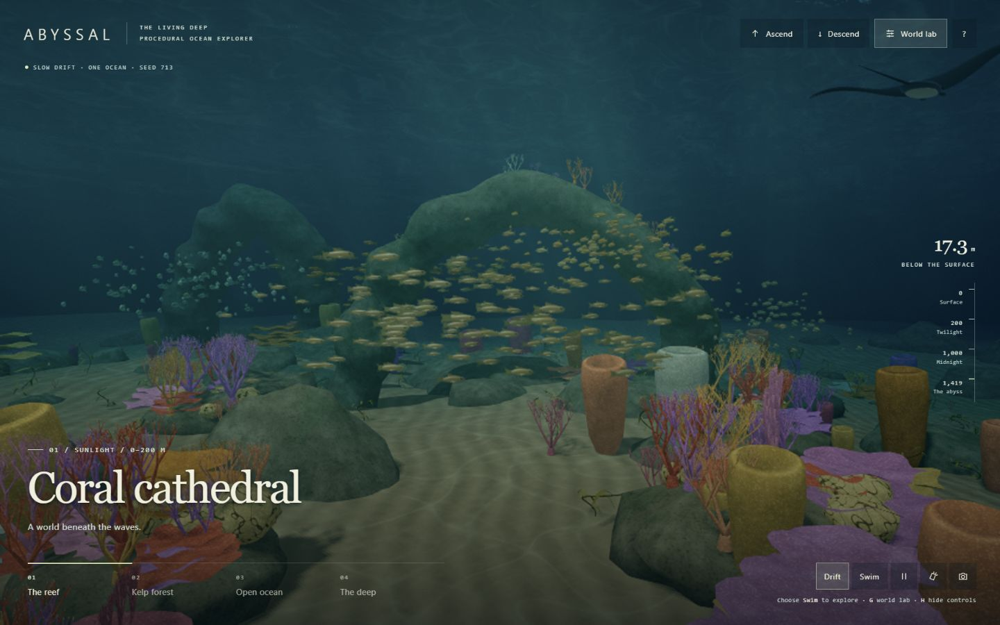
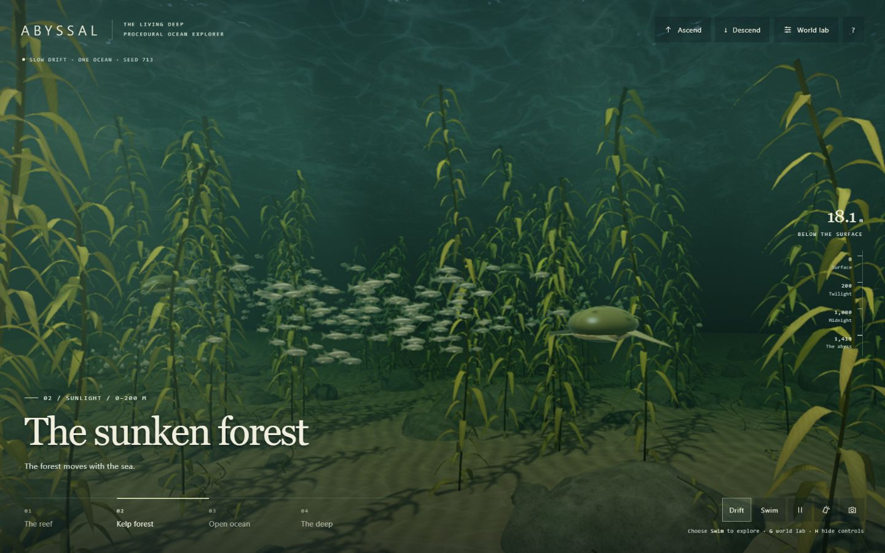
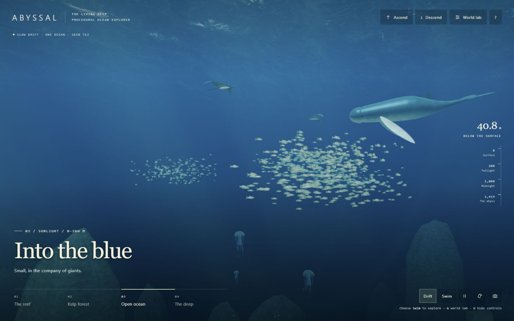
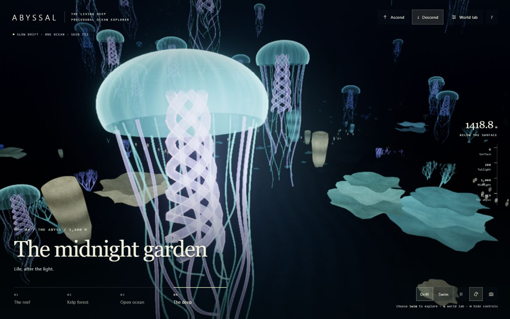

# ABYSSAL — The Living Deep

A procedural expansion of [ABYSSAL by Token-Gremlin](https://github.com/Token-Gremlin/natural-disasters). Grow one connected ocean from a seed: a sunlit reef, a kelp forest, the continental slope and a 1,400-metre trench. Swim through the waves into the sky, or follow the canyon into the dark.

[**Explore the living deep**](https://abyssal-living-deep.netlify.app/)



## One ocean, four habitats

| Dive site | Landscape and life |
| --- | --- |
| Coral cathedral | Eroded limestone arches, layered reef shelves, branching and plate coral, barrel sponges, brain coral, shoals and manta rays. |
| The sunken forest | A seeded canopy of giant kelp, individually modeled ribbons, sandy channels, silver fish and swimming turtles. |
| Into the blue | A continental drop-off, stone pinnacles, a passing humpback whale, shoals and drifting jellies. |
| The midnight garden | Mineral chimneys, rising vent plumes, tube worms, luminous colonies and pulsing jellyfish. |

All four habitats exist together in one generated landscape. The site buttons travel between them; they do not replace the scene or reset the weather. **Ascend** rises vertically to the surface. **Descend** follows the canyon from the shelf, or dives directly when you are already over the trench. Choose a depth stop, interrupt a journey with **Stop here**, or swim freely with **Q / E** to descend and ascend.

**World lab** changes the whole ocean. Numeric and text seeds are reproducible; **New seed** grows another landscape. **Copy world link** includes the seed, starting habitat or depth, procedural dials, weather settings and any explicit quality choice.

| The sunken forest | Into the blue |
| --- | --- |
|  |  |



## Procedural dials

- **Terrain relief** changes the seeded seafloor and rock formations.
- **Living cover** rebuilds the density of coral, kelp and benthic life.
- **Kelp height** rebuilds the forest canopy, wherever you are in the ocean.
- **Fish abundance** rebuilds shoals and changes jellyfish abundance. Zero removes all swimming animals.
- **Water clarity** changes wavelength-dependent extinction and visibility.
- **Current strength** controls water advection, swimming drift, kelp and particles. Surface weather and disaster currents weaken with depth.
- **Bioluminescence** controls living light, especially at night and in the deep.
- **Deep upwelling** changes the vent plumes and upward flow. Its nutrients gradually feed a surface bloom, which glows when waves disturb it at night.
- **Sun elevation, cloud cover, wind, swell and storm intensity** drive shared weather. Expand **More weather dials** for direction, swell period, choppiness, amplitude, rain, haze and cloud density. Day, dusk, storm and night provide starting conditions.

**Trigger a seafloor tremor** stirs sediment around the deep vents and sends an expanding wave train across the surface. The event continues while you ascend, descend or visit another habitat. The original rogue waves, whirlpools, tsunamis, lightning, waterspouts and hurricanes are available in the same lab.

Geometry dials rebuild on release. Water and weather dials respond while dragging. Use the arrow keys for small changes and Home/End for the limits.

## Explore

| Control | Action |
| --- | --- |
| **Ascend / Descend** | Continuous travel to the surface / abyss |
| **Depth stops** | Travel to the surface, twilight, midnight or vent garden |
| **Drift / Swim** | Drift in place / manual exploration |
| **W A S D** | Swim in the direction you look |
| **Drag** | Look around |
| **Q / E** | Down / up |
| **Shift** | Swim faster |
| **Mouse wheel** | Zoom |
| **1–4** | Travel to a habitat in the same ocean |
| **G / R** | Open world lab / generate a new seed |
| **F / P / H** | Toggle swimming / pause simulation / hide controls |
| **L** | Override the automatic deep-water light |
| **Camera button** | Save a PNG without the interface |
| **Float at the waterline** | Follow the actual waves at the boundary between air and water; in World lab → View |

Touch layouts provide hold-to-swim buttons and drag-to-look. Desktop graphics are recommended. The scene requires WebGL2 and floating-point render targets; automatic quality scaling and lower presets help slower devices. Phone hardware performance is not guaranteed.

## The original ocean is still here

The surface retains the original multi-cascade FFT waves, volumetric atmosphere and clouds, rain, lightning, waterspouts, whirlpools, hurricanes, rogue waves and tsunamis. Both sides share a clock and the same live weather and disaster fields. Storms stir the shallows, whirlpools draw water down, and long waves transfer momentum below the surface. Upwelling and seafloor tremors affect the sea above.

The waterline samples all three FFT cascades and live event displacement. Clear water reveals the generated reef from above; the underwater window refracts the actual sky environment. Crossing the surface blends the two views at the moving wave boundary. Sunlight, water colour, exposure and the dive light change gradually through the descent.

Below the surface are a continuous seeded seabed, a steep canyon, cold-water colonies, drifting siphonophore chains, wavelength-dependent attenuation, wave-driven caustics, shadows, light shafts, marine snow, kelp, instanced schools and generated animals. Cloud-volume baking preserves every depth slice, and the night sky includes procedural stars and a moon. Everything is generated from JavaScript and GLSL. There are no downloaded textures, models, fonts or audio files. Repository screenshots are documentation only.

Travel speeds and transport times are compressed for exploration. This is an artistic simulation, not an ecological, oceanographic or disaster-prediction model.

## Run locally

Requires Node.js 20.19+ or 22.12+.

```sh
npm ci
npm run dev
```

```sh
npm test        # quality, generation, terrain, journeys and coupled flow/event checks
npm run build  # static site in dist/
npm run preview
```

Deploy `dist/` to any static host. `netlify.toml` contains the Netlify build settings. The GitHub Pages workflow is available for manual use; it does not deploy automatically.

### Reproducible URLs

```text
?site=reef&seed=713
?site=kelp&seed=5819&life=1.3&height=1.2&current=1.5
?site=deep&seed=82017&glow=1.5
?site=reef&seed=713&depth=200
?site=deep&seed=713&surface=1&light=night&upwelling=3
?site=reef&seed=713&light=storm&preset=high&adaptive=0
```

Supported sites: `reef`, `kelp`, `blue`, `deep`. The default world seed is 713 for every starting site. Numeric recipes are clamped to the supported dial ranges. Text seeds become a stable 32-bit seed. `surface=1` starts above water; `depth=200` starts at a point on the canyon route. The original quality and profiling parameters continue to work; see the [upstream documentation](docs/UPSTREAM.md).

## Code

The existing rendering pipeline remains in `src/core`, `src/ocean`, `src/sky`, `src/weather` and `src/post`. The underwater extension is in `src/underwater`:

| File | Purpose |
| --- | --- |
| `WorldMath.js` | Seeded randomness, recipes, floor field, current attenuation and swimming bounds |
| `OceanDomain.js` | Continuous bathymetry, habitat placement, depth stops and safe routes |
| `OceanDynamics.js` | Depth-dependent currents, upwelling, nutrient transport and seafloor pulses |
| `OceanTerrain.js` | Continuous shelf and canyon, wall colonies and midwater life |
| `WaterInterface.js` | Actual-wave probe and continuous air/water compositing |
| `ReefGeometry.js` | Generated terrain, arches, coral, kelp, sponges and vents |
| `MarineLife.js` | Generated animal anatomy and instanced schooling motion |
| `UnderwaterMaterial.js` | Surface shading, caustics, absorption, fog and water ceiling |
| `UnderwaterWorld.js` | World generation, light shafts, shadows, particles and render integration |
| `Expedition.js` | World lab, sharing, exploration controls and habitat selection |

Logic tests cover all habitat-to-habitat routes across multiple seeds and terrain settings, agreement between rendered terrain and collision height, pause invariants, and effects in both directions. They do not replace visual testing. Inspect all habitats, complete ascent/descent journeys, the waterline, and clear/dusk/storm/night conditions. Keep the source free of external art assets.

## Credits and license

Based on **ABYSSAL / natural-disasters**, created by **Davi (Token-Gremlin)**. The original authorship, Git history and MIT license are retained. This fork adds the procedural underwater world. Three.js is the sole runtime dependency.

[MIT license](LICENSE) · [Original project](https://github.com/Token-Gremlin/natural-disasters) · [Original documentation and references](docs/UPSTREAM.md)
